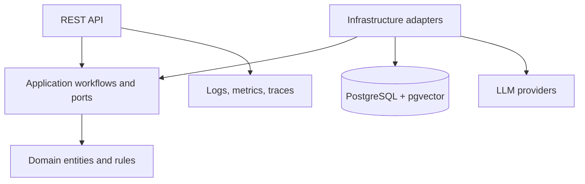

# FlowForge Architecture

FlowForge is a modular monolith with Clean Architecture boundaries:

The API remains stateless. PostgreSQL is the source of truth for business and execution state. Redis is optional shared ephemeral infrastructure, not a second source of truth. n8n is an external integration/automation adapter; FlowForge owns authorization, workflow state, and AI execution semantics.

Current application ports include repositories, embeddings, knowledge search, `ILLMProvider`, `ILLMGateway`, token cost calculation, and `IWorkflowOrchestrator`. Provider SDKs and EF Core remain in Infrastructure.

The first deployment should remain one API plus one worker process when asynchronous ingestion is introduced. Split services only when independent scaling, isolation, or release cadence is demonstrated by measurements.
