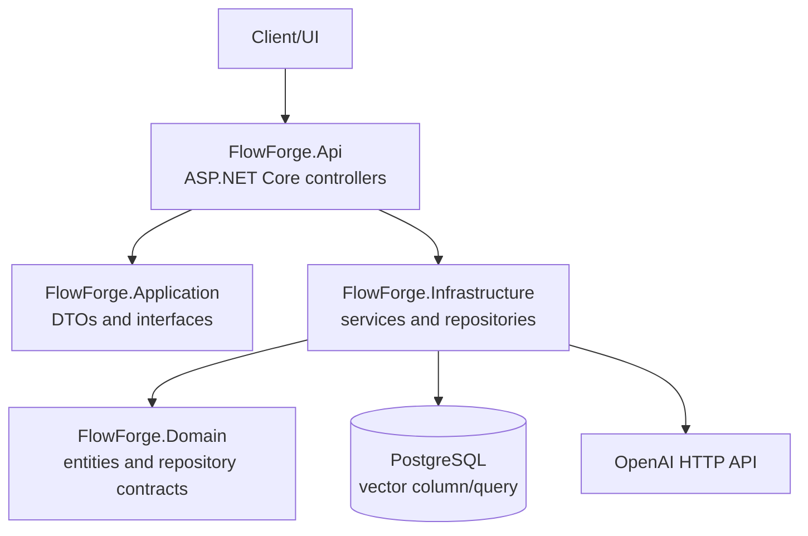
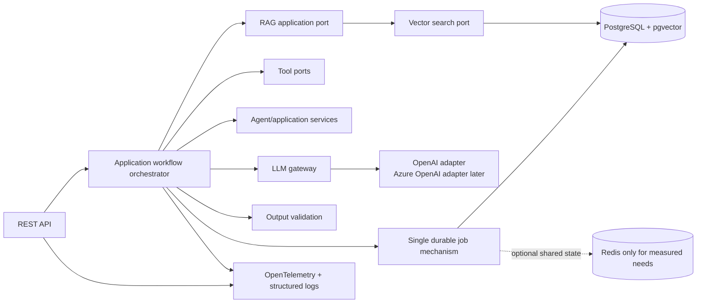

# FlowForge AI Architecture Gap Analysis

**Date:** 2026-09-04  
**Scope:** `backend/` repository as inspected before implementation changes

## Executive Summary

FlowForge is currently a modular ASP.NET Core prototype with four projects: API, Application, Domain, and Infrastructure. It already supports JWT authentication, client memberships/RBAC primitives, agent management, conversations, document parsing/chunking, OpenAI chat/embeddings, PostgreSQL persistence, and a pgvector similarity query. The system is not yet production-ready: startup contains malformed/dead code, secrets are committed in configuration, the OpenAI integration is directly coupled to one provider and logs payloads/secrets, and there are no operational controls for health/readiness, resilience, rate limiting, background processing, observability, idempotency, or deployment automation.

The recommended direction is a modular monolith with explicit application ports, a provider-neutral LLM gateway, a workflow execution model, PostgreSQL as the source of truth, Redis only where a concrete distributed-state need exists, and one asynchronous processing mechanism when background work is introduced. Avoid splitting into microservices until independently scaling or deploying a bounded context is demonstrated to be necessary.

## Current Architecture

### Projects and boundaries

| Project | Current responsibility | Assessment |
|---|---|---|
| `FlowForge.Api` | Program startup, controllers, JWT/CORS/Swagger registration | Correct outer boundary, but startup and error handling need repair. |
| `FlowForge.Application` | DTOs, service interfaces, permissions | Useful ports exist; several infrastructure-facing concerns have not been modeled. |
| `FlowForge.Domain` | Entities, base entity, repository interfaces | Domain is dependency-light; business invariants are mostly in services. |
| `FlowForge.Infrastructure` | EF Core context, repositories, file parsing/storage, auth, chat, OpenAI, embeddings | Contains most behavior and directly owns external providers. |
| `FlowForge.Tests` | xUnit tests for chat and knowledge search | Small unit-test baseline; no integration or end-to-end test host. |

## Current Components and Implemented Functionality

### API

- REST controllers for authentication, clients, invitations, agents, chat, knowledge, and health.
- Swagger/OpenAPI with a bearer security definition.
- JWT bearer authentication and controller-level `[Authorize]` on chat.
- A permissive development CORS policy for localhost origins.
- `/health` currently returns a static healthy response.

### Application and domain

- DTOs for auth, chat, agents, and knowledge.
- Repository/service contracts for users, clients, agents, conversations, messages, knowledge, auth, tenant context, auditing, parsing, chunking, embeddings, and OpenAI chat.
- Client membership roles and permission constants.
- Entities for users, clients, memberships, invitations, audit logs, agents, conversations, messages, knowledge documents, and chunks.
- GUID identifiers and tenant/client fields on most AI-facing entities.

### Persistence and RAG

- EF Core `ApplicationDbContext` backed by Npgsql.
- PostgreSQL migrations, including a `vector` column for knowledge chunk embeddings.
- pgvector nearest-neighbor SQL using the `<->` distance operator.
- Document extraction, text chunking, embedding generation, chunk persistence, and similarity retrieval.
- RAG is only partial: chat currently builds a prompt from conversation history and does not visibly retrieve knowledge context in the chat path; metadata filtering/reranking/evaluation are absent.

### AI integration

- OpenAI Responses API call for chat and OpenAI embeddings endpoint.
- Model and API key options are bound from configuration.
- No provider-neutral request/response contract, usage/cost model, prompt version, request tracking, fallback, or structured-output validation.

### Tests

- Unit tests cover basic chat service behavior with a mocked OpenAI service.
- Unit tests cover forwarding a knowledge search request to its repository.
- No deterministic fake provider, resilience tests, database tests, API tests, authentication tests, or workflow tests.

### DevOps and infrastructure inventory

- A multi-stage Dockerfile builds and publishes the API.
- Project guide documents a broader intended stack including pgvector, Redis, n8n, pgAdmin, and a frontend, but those runtime definitions are not present in this backend repository inventory.
- No Docker Compose, CI/CD workflow, infrastructure-as-code, OpenTelemetry setup, Redis registration, queue worker, Hangfire/AsynQ registration, or automated security scanning was found.

## Missing Functionality

### P0: required before production use

1. Remove committed API keys and hard-coded secret fallbacks; use environment/secret-store configuration and fail safely when required production settings are absent.
2. Repair startup flow: duplicate CORS registration, empty scope, malformed `using` block, no migration policy, and static health-only endpoint.
3. Add RFC 7807 ProblemDetails and centralized exception handling without leaking exception details.
4. Add liveness/readiness checks for PostgreSQL and, if adopted, Redis.
5. Enforce resource-level tenant authorization consistently across all controllers and repositories.
6. Add request validation, payload/file size limits, secure CORS, rate limiting, and safe authentication configuration.
7. Remove secret/payload logging and replace console writes with structured logging.
8. Add baseline build/test automation and dependency/secret scanning.

### P1: production architecture and operability

1. Introduce a provider-neutral LLM gateway with timeout, bounded transient retry, cancellation, provider/model selection, usage, latency, correlation/request IDs, and cost calculation.
2. Introduce workflow and workflow-execution abstractions with explicit status, timestamps, errors, correlation, duration, tokens, and cost.
3. Define one asynchronous processing mechanism for document ingestion and future workflows, including job IDs, attempts, backoff, idempotency, cancellation, and dead-letter handling.
4. Add OpenTelemetry traces, metrics, correlation propagation, and structured logs across HTTP, workflow, RAG, database, and LLM boundaries.
5. Improve RAG boundaries: vector search contract, metadata filters, embedding model configuration, dimension validation, transaction behavior, and evaluation dataset.
6. Add deterministic fake LLM providers and unit/integration/API tests for success, timeout, rate-limit, transient failure, invalid output, and duplicate processing.
7. Add prompt versioning and structured output validation for workflows that require typed results.
8. Document Redis's concrete role, key/TTL policy, failure behavior, and the n8n boundary before adding either as a dependency.

### P2: scale and portfolio completeness

1. Add cost reporting by workflow/user/tenant/provider/model/date.
2. Add durable AI request/audit records with configurable sensitive-payload retention.
3. Add pgvector index strategy after measuring dataset size and query plans.
4. Add integration-test containers or an equivalent managed test environment for PostgreSQL/pgvector and Redis.
5. Add production Docker Compose/deployment separation, non-root runtime, health checks, and Azure deployment/IaC only where maintainable.
6. Add architecture/operations/security/deployment/RAG evaluation documentation and ADRs.

## Technical Debt

- `Program.cs` contains duplicate CORS middleware and an empty service scope; the startup structure is not maintainable.
- Controllers contain repeated permission and claim parsing logic and expose infrastructure `ApplicationDbContext` directly in `AuthController`.
- `ChatService` duplicates message-send logic and calls two repository `SaveChangesAsync` methods for one operation.
- `ChatService` assembles prompts as untyped strings and does not use the knowledge search pipeline.
- `OpenAiService` has duplicated response parsing, duplicate configuration imports, hard-coded URLs, and console logging.
- `EmbeddingService` hard-codes the embedding model and does not verify response ordering/dimensions.
- EF entity mappings are centralized but do not show explicit vector dimension/index configuration or complete concurrency/tenant constraints.
- Some generated `bin/` and `obj/` artifacts are present in the repository view; they should be excluded from source control.
- Naming/style inconsistencies exist, including an action named `chatserviceGetConversations` and duplicated imports.
- Error handling is controller-specific and returns anonymous `{ message }` payloads.

## Security Risks

- Real-looking OpenAI keys are committed in `appsettings.json` and `appsettings.Development.json`; they must be revoked/rotated immediately outside this code change.
- JWT has a weak development fallback key in service registration. Production must require a strong externally supplied key.
- Connection strings contain plaintext credentials in tracked configuration.
- `OpenAiService` logs the API key prefix and full response body to stdout, which can expose secrets or sensitive prompts/responses.
- No global exception policy, rate limiting, request size limits, security headers, or production CORS policy is visible.
- Authorization is inconsistent and relies on repeated controller checks; all resource lookups must include tenant/user scope.
- File upload and document processing require explicit content-type, size, extension, storage-path, and parser hardening.
- AI prompts and responses are not governed by a configurable sensitive-payload logging/retention policy.

## Scalability Risks

- No durable background processing; document ingestion and embedding work can occupy API request threads and time out.
- No distributed rate limiter, cache, lock, idempotency store, or queue is configured.
- In-memory startup behavior and static health response do not represent dependency state.
- Vector search has no visible approximate-neighbor index or dimension contract.
- Conversation retrieval may load full message collections and prompt history without pagination/token budgeting.
- LLM calls have no timeout, bounded retry, circuit breaker, concurrency limit, or fallback.
- Horizontal scaling would make duplicate conversation creation and retried side effects more likely without database uniqueness/idempotency controls.

## Reliability Risks

- Startup may fail or behave unexpectedly because of malformed/empty code around the database seeding scope.
- `EnsureSuccessStatusCode` is used without classifying transient, rate-limit, validation, and authentication failures.
- Partial chat persistence can leave a user message without an assistant response; no execution state or recovery record exists.
- No cancellation/dead-letter policy exists for document processing.
- No correlation/request tracking exists across HTTP, database, embedding, and LLM calls.
- Static `/health` can report healthy while PostgreSQL or an external dependency is unavailable.

## Recommended Target Architecture

Keep a modular monolith with these bounded modules:

The dependency direction remains `Domain -> Application -> Infrastructure -> API` at the project level (with references pointing inward). Application contracts should represent LLM, workflow, vector search, cost, idempotency, and job concerns without importing EF Core, Redis, or provider SDKs. Infrastructure adapters implement those contracts.

### Design decisions

- **Modular monolith first:** one deployable API/worker boundary minimizes operational complexity while preserving module boundaries.
- **LLM gateway:** provider adapters behind one application contract make fallback, cost, usage, and test fakes possible.
- **PostgreSQL source of truth:** retain relational data and pgvector together; add indexes based on measurements.
- **Redis selectively:** use only for shared, ephemeral concerns such as rate limits, distributed locks, or idempotency where PostgreSQL is not a better fit; document every key and TTL.
- **One job mechanism:** choose a durable queue/worker approach for the actual deployment target; do not run Hangfire and another queue for the same work.
- **n8n as an integration adapter:** n8n may trigger or react to FlowForge workflows, but application workflow state and authorization remain in FlowForge.
- **No custom API gateway initially:** use ASP.NET Core plus platform/API-management controls until independent gateway concerns justify Azure API Management.

## Prioritized Implementation Plan

### Phase 1: foundations

- Complete and keep this gap analysis current.
- Repair startup and dependency registration.
- Remove secrets from tracked configuration and add production validation.
- Add ProblemDetails, request limits, secure CORS, liveness/readiness, and consistent logging.
- Add architecture baseline tests and CI build/test.

### Phase 2: reliability

- Add explicit workflow execution/job state.
- Introduce idempotency enforcement and database uniqueness where appropriate.
- Add bounded timeout/retry/backoff and classify dependency failures.
- Move document processing to one durable asynchronous mechanism.

### Phase 3: AI architecture

- Add LLM request/response contracts and provider adapter.
- Track token usage, latency, correlation, prompt version, and estimated cost.
- Add output validation and deterministic fake providers.
- Connect the workflow orchestrator to RAG and LLM ports.

### Phase 4: RAG quality

- Add metadata-aware vector search, embedding dimensions, context budgeting, and optional reranking.
- Add representative evaluation data and repeatable retrieval/answer/latency/cost measurements.

### Phase 5: security and observability

- Centralize resource authorization and tenant isolation.
- Add rate limiting, security headers, audit policy, OpenTelemetry traces/metrics, and sensitive-payload controls.

### Phase 6: infrastructure and documentation

- Add integration/E2E tests, Docker health checks/non-root runtime, CI security checks, deployment configuration, and ADRs.
- Document Redis, resilience, security, observability, deployment, AI costs, idempotency, and n8n boundaries.

## Definition of Done for Production Readiness

- No secrets in source control; production configuration fails closed.
- Build, unit tests, integration tests, and security checks run in CI.
- Health endpoints distinguish process liveness from dependency readiness.
- Every AI operation has bounded execution, traceability, usage/cost metadata, and safe error handling.
- Retried jobs and requests are idempotent and observable.
- Tenant/resource authorization is enforced at the application/data access boundary.
- PostgreSQL/pgvector, Redis, queues, and n8n have explicit documented roles and failure behavior.
- Operations can explain request latency, workflow status, LLM cost, and failure cause without inspecting sensitive payloads.
